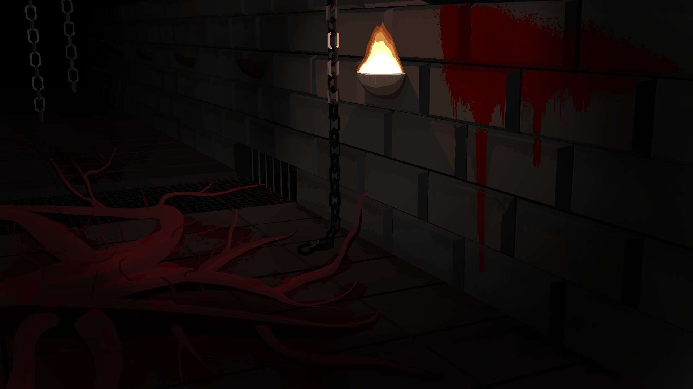

# The Wicket

My main individual project which I'm working on for about 4 years. It's a game that combines logic, skill and adventure in a world of hostile desolation. The game is still in development, but its first chapter is completed and ready for beta-testing. The game is written in vanilla C++ and DirectX 11 engine.

[More...](https://robert-salata.github.io/The-Wicket/)

# Squirrel-Math

An extensive project I'm working on in collaboration with my friend, [Creestoph](https://github.com/Creestoph/). It aims to be an educational platform teaching mathematics, enhanced by interactive software and rich visuals. Primary foundation of the website is to lead an user through the whole  process of math education in a clear, ordered manner, starting from the very basic concepts like natural numers, and ending on integration, complex analysis or even further. I'm responsible for all the contents of website, graphic design and some of the scripts. The website uses Vue.js framework.

[Visit Squirrel-Math](https://squirrel-math.firebaseapp.com/)

# Crystal Reign

An university team project: Third Person Shooter proof of concept, created in Unity 3D (C#) and Blender. The goal is to survive and defeat as many enemies as possible. The game implements mechanics of environment destruction and allows partial control of resulting debris. I'm responsible for all the modelling, scene design and partially for movement and destruction mechanics.

[More...](https://github.com/MonikaTworek/Crystal-Reign)

# Tetris

A simple mobile application I created for university classes. It turned out simple and enjoyable. Compilable sources are available in repository:

[Sources for Android Studio](https://github.com/boberrs/Tetris)
